# Echos - Foodie

## Project Overview

**Foodie** is a mobile application that helps users discover low-calorie, nutritionally balanced recipes and healthy cocktails. The app supports users in managing their weight and achieving weight-loss goals while enjoying delightful drink options.

**Figma Design:** [Figma Design](https://www.figma.com/design/M2S5wKCzyA20lElct9k79k/Echos---Foodie?node-id=0-1&t=9Wi7V6X0zxCnl257-1)

---
## Setup and Usage
### Step 1: Clone the Repository

```bash
git clone https://github.com/xxyen/foodie.git
cd foodie
```
### Step 2: Configure the Backend
Navigate to the backend folder and create or update the .env file with the following variables:
```bash
GOOGLE_CLIENT_ID=your_google_client_id
GOOGLE_CLIENT_SECRET=your_google_client_secret
NODE_ENV=development
MONGODB_URI=your_mongodb_connection_uri
```
Then install dependencies and start the backend server:
```bash
cd backend
npm install
npm run dev
```
### Step 3: Start the Frontend
Open a new terminal tab and navigate to the frontend folder:
```bash
cd ../Foodie
npm install
npm start
```
You can now test the app using:
- iOS/Android simulators, or
- Expo Go App: Scan the QR code generated by npm start to test the app on your phone.

### Special Note for Google OAuth2 Login
- **On Simulators**: Google OAuth2 login works without additional configuration.
- **On Expo Go (Mobile Device)**:
Update the `APP_SCHEMA` in `server.ts` to match the IP address of the machine running the frontend:
 ```bash
 const APP_SCHEMA = "exp://<your-machine-ip>:8081/--/";
```
- This is required because the Expo Go app on your mobile device and the machine running the frontend are not the same device, necessitating this configuration for Google OAuth2 login to function correctly.

---

## Technical Details
- Framework: React Native, Express.js (Node.js).
- Database: MongoDB.
- Deployment: AWS EC2.

---

## Features

### 1. Recipe and Cocktail Discovery
- **Random Recipe Display**: View randomly selected recipes or cocktails.
- **Search Options**:
  - **Text Search** with auto-completion.
  - **Categorized Search** based on dietary needs.
  - **Image Search**: Take a photo or upload an image to identify an ingredient and find recipes using that ingredient.
- **Detailed Recipe Information**:
  - Ingredients.
  - Preparation steps.
  - Nutritional details.

### 2. User Personalization
- **Favorites**: Save favorite food or cocktail recipes for easy access.
- **Profile**: Custom Icons for users, supporting both uploading pictures from album or taking images.
- **Shopping List**: Add ingredients from recipes directly to a shopping list and manage it.
- **Calorie Intake**: Track calorie intake by adding recipes to a daily diet plan.
- **Allergy Settings**: Set allergy preferences to exclude specific ingredients from search results.
- **Diet Settings**: Set diet while signup.

### 3. Calorie Tracking
- **Weekly Overview**: View daily calorie intake for the past week.

### 4. Chatbot Integration
- **Dietary Advice**: Chat with an AI-powered bot for recipe suggestions or dietary advice.

### 5. User Signup and Login
- **Signup**: Users could signup the app by providing valid unique Username as well as Email Address, and also a valid Password. 
- **Login**: We provide two different methods for logging in: 1. signed up user through the signup page; 2. Google OAuth2 Authentication.
- **Forget Password**: If users remember their email address, our server will send to the user's given email address a 3 minute valid token. If the users input the correct token within 3 minute, it will lead to a password reset page.  

---

## Native and Unique Features

### Native Features
- **Image Taken**: Utilize the device camera to take photos.

### Unique Features
- **Authentication**:
  - Email-password registration and login.
  - Google OAuth2 login.
- **Image Recognition**: Powered by OpenAI API.
- **Chatbot**: Leveraging Spoonacular API for dynamic recipe conversations.
- **Custom Components**: Built to enhance app performance and user experience.

---

## APIs Used
The app integrates several APIs to deliver a seamless experience:
- **OpenAI API**: For ingredient recognition from images.
- **Spoonacular API**: 
  - Recipe search, auto-completion, and detailed nutritional information.
  - Chatbot interactions.
  - Ingredient image fetching.
- **TheCocktailDB API**: For cocktail recipes and ingredient images.

---

## App Screenshots

Here’s a preview of some core features in the Foodie app.

### Recipe Discovery
| 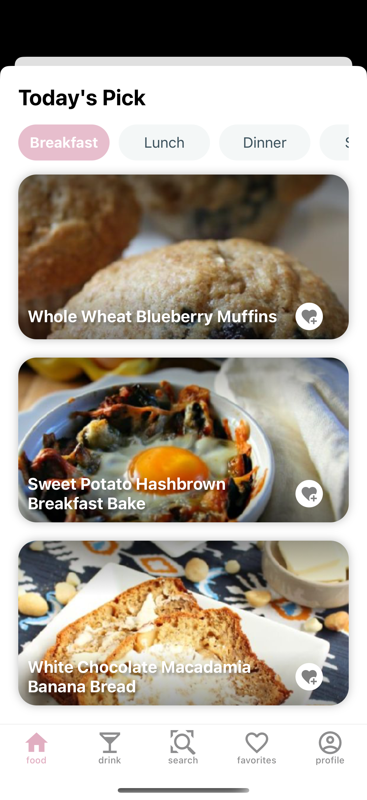 | 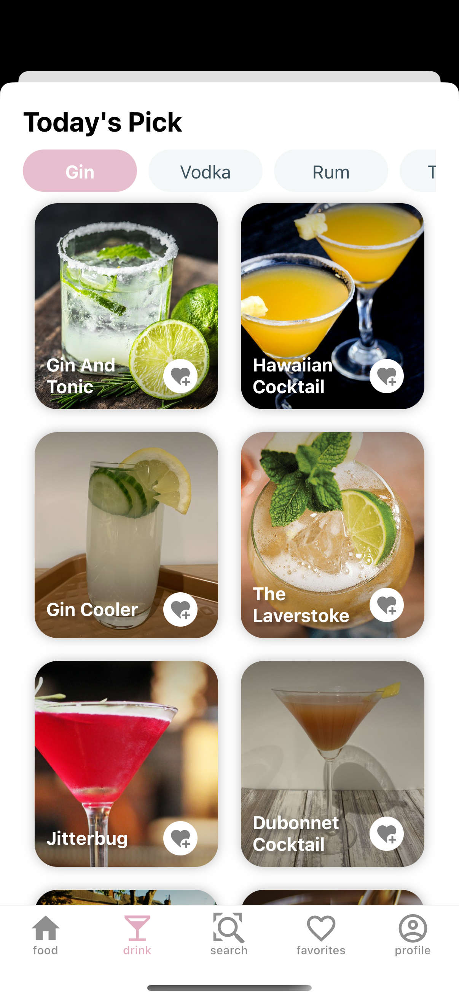 | 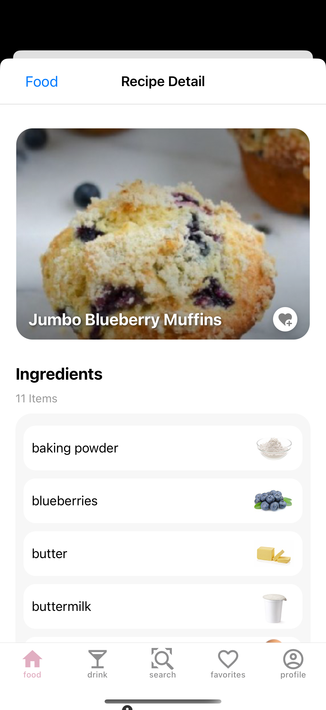 | 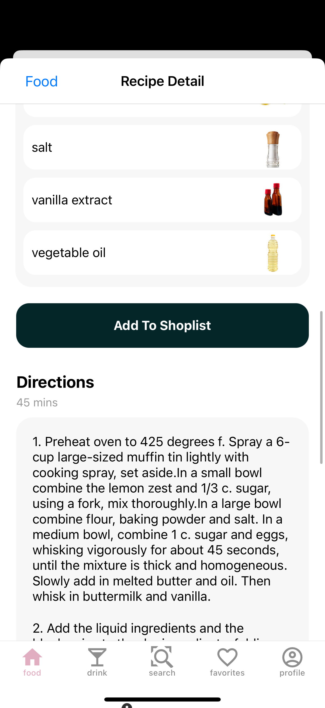 | 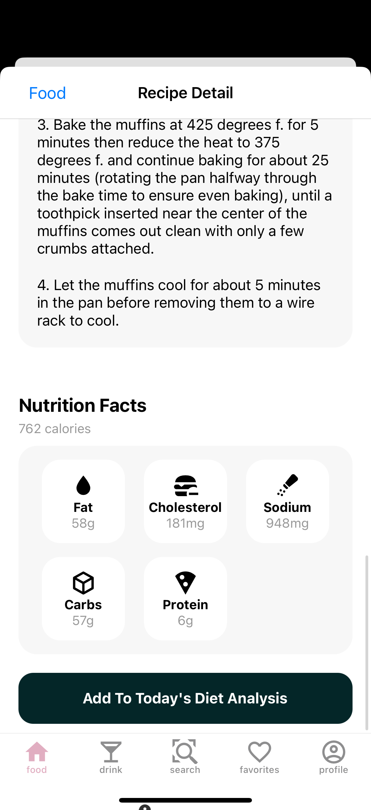 |
|:--:|:--:|:--:|:--:|:--:|

### User Personalization
| 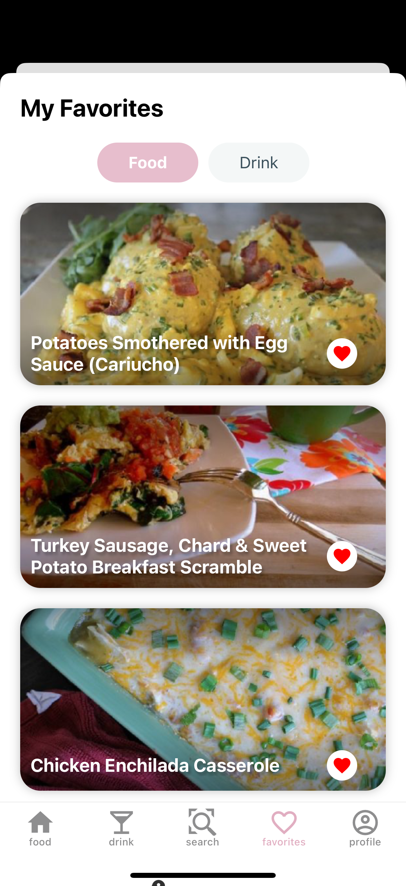 | 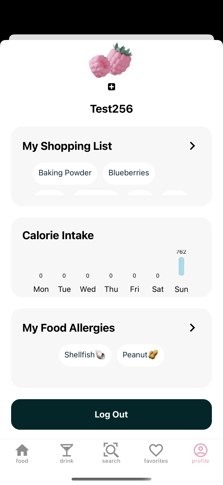 | 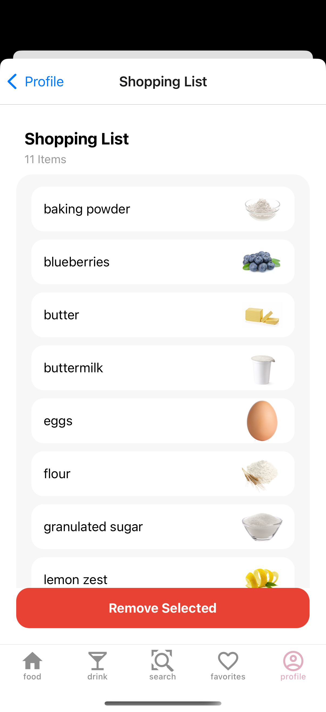 | 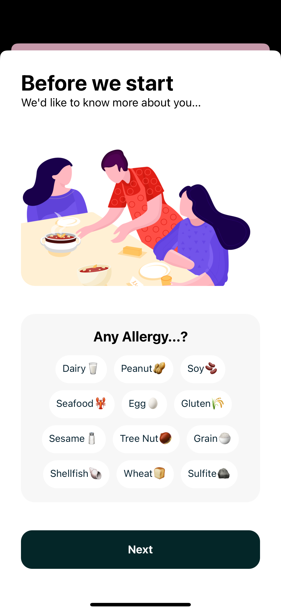 | 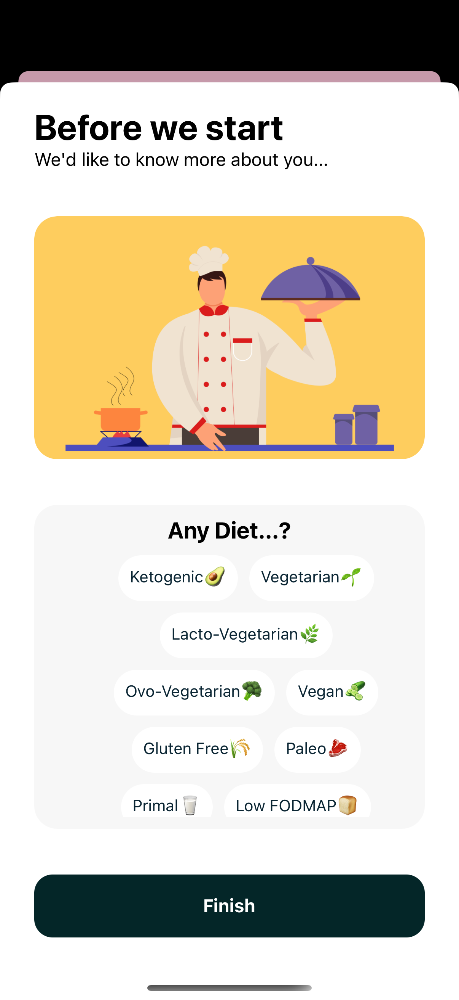 | 
|:--:|:--:|:--:|:--:|:--:|

### AI-Powered Features
| 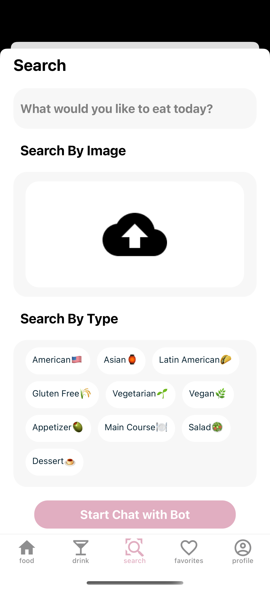 | 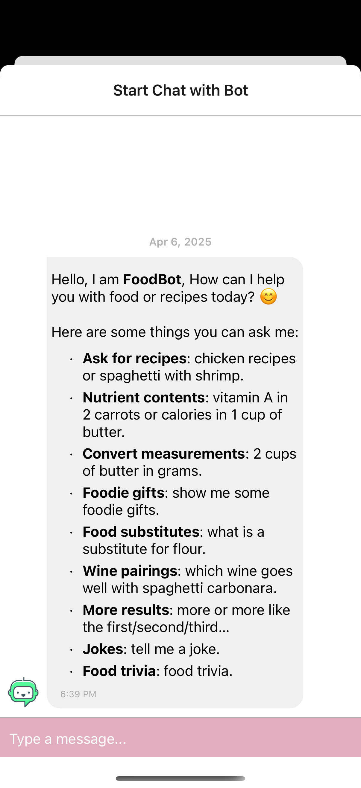 | 
|:--:|:--:|

### User Signup and Login
| 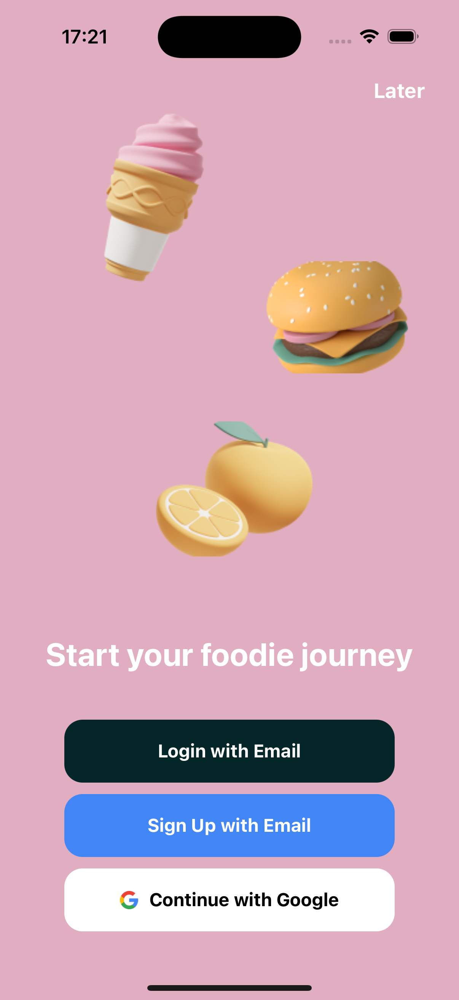 | 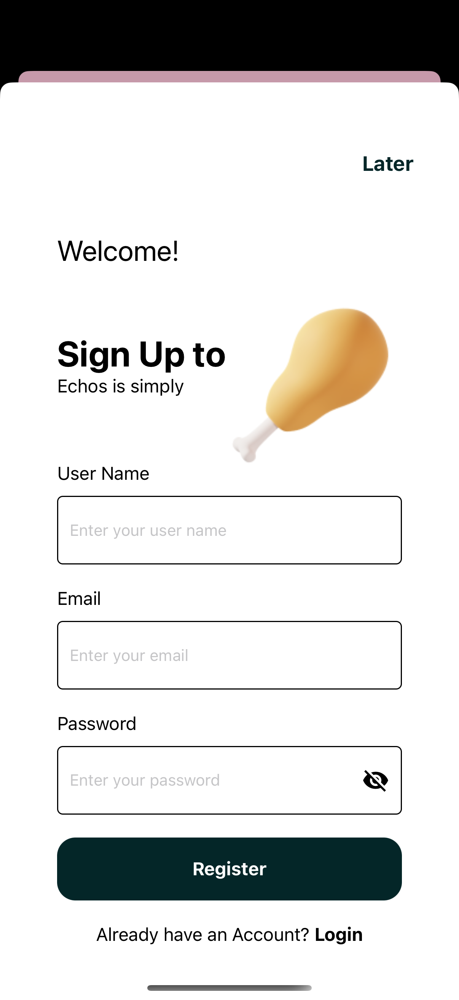 | 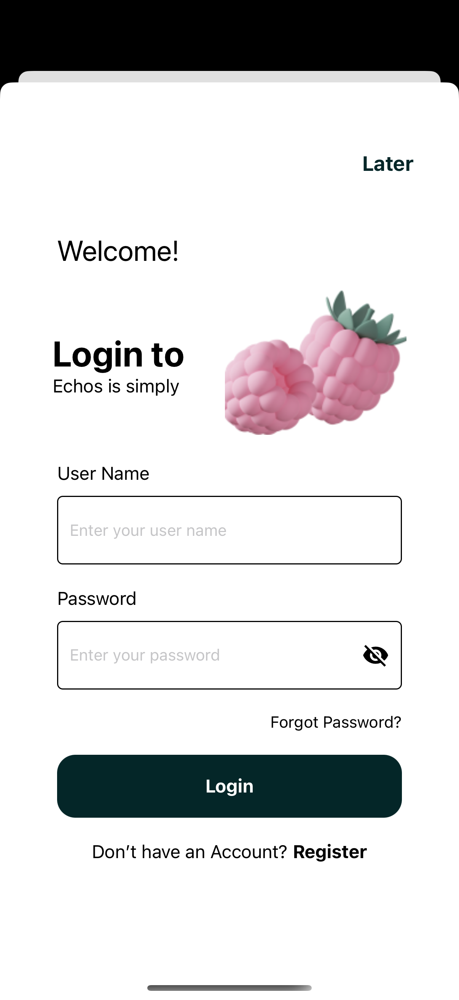 | 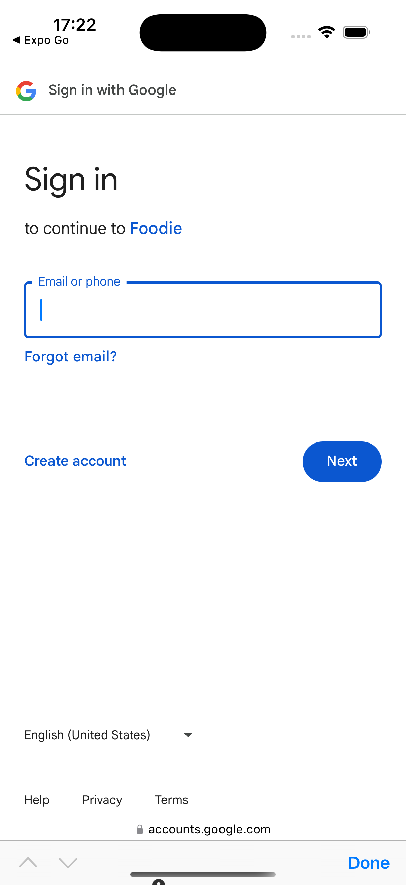 | 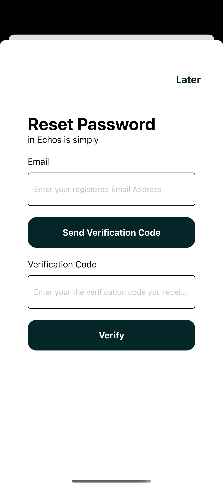 |
|:--:|:--:|:--:|:--:|:--:|